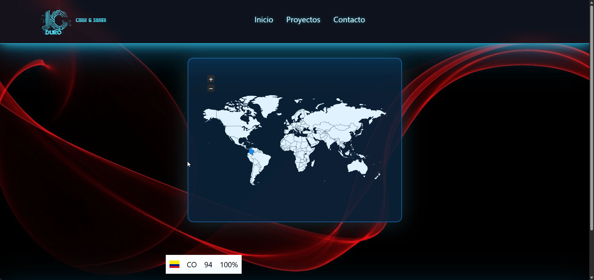

##🌟 Visit Map – Mapa de visitas por país
Proyecto que registra las visitas a un sitio web en una base de datos y las muestra en un mapa mundial interactivo junto con una tabla de países, usando PHP, MySQL, jVectorMap y banderas por país.

--- 

## ✨ Características
- Registro automático de cada visita (IP, país, página, user agent, fecha y hora).
- Almacenamiento de visitas en la tabla visitas_mapa en MySQL.
- Mapa mundial interactivo con jVectorMap, coloreando/mostrando los países con visitas.
- Tabla con países, cantidad de visitas y porcentaje respecto al total.
- Iconos de banderas por país usando una carpeta de flags (iso2 → bandera).
​
---

##✨ Vista previa



---

## ✨ Pruevalo Online

[Mapa_Visitas](https://jcduro.bexartideas.com/proyectos/dashjc/map.php)

--- 

## ✨ Tecnologías utilizadas

✨ Backend / Servidor
PHP 7+
MySQL / MariaDB (consulta y agregación de visitas)
PDO para conexión y consultas preparadas (conexion.php)

✨ Frontend
HTML5
CSS3 (style.css, jquery-jvectormap.css)
JavaScript (ES5/ES6)
jQuery
jVectorMap (jquery-jvectormap.min.js, jquery-jvectormap-world-mill-en.js) para el mapa mundial.
Librería de banderas en CSS + carpeta flags (clases tipo flag-icon-xx o similar).

---
​
## 📊 Lenguajes y Herramientas

[](https://skillicons.dev)

---

## ✨Estructura de archivos
 ```text
/
├─ map.php                  # Página principal: muestra mapa y tabla
├─ geo_helpers.php          # Funciones auxiliares para geolocalización / helpers de país
├─ get_visitas_map.php      # Endpoint para devolver datos agregados al mapa (JSON)
├─ track_visit.php          # Lógica de registro de cada visita en la BD
│
├─ css/
│  ├─ jquery-jvectormap.css # Estilos base de jVectorMap
│  ├─ style.css             # Estilos personalizados del proyecto
│  ├─ flag-icon.min.css
│  ├─ 4x3 / # Iconos de Banderas # Recursos de banderas por país (PNG/SVG)
│  └─ 1x1 / # Iconos de Banderas # Recursos de banderas por país (PNG/SVG)
│
├─ js/
│  ├─ jquery-jvectormap.min.js         # Plugin jVectorMap
│  ├─ jquery-jvectormap-world-mill-en.js # Mapa mundial (proyección mill)
│  └─ map.js                           # Inicialización del mapa y configuración visual
                           

 ```
--- 

## ✨Flujo de funcionamiento
Registro de visita

map.php incluye track_visit.php.

track_visit.php obtiene IP, país (ISO 2), página, user agent y fecha/hora y guarda un registro en visitas_mapa.
​

--- 

## ✨Obtención de datos para el mapa / tabla

Desde map.php y/o get_visitas_map.php se consulta la tabla visitas_mapa, agrupando por iso_pais y contando visitas.
​
--- 

## ✨El resultado se usa:

Para construir la tabla (PHP).
Para alimentar el mapa (JS) vía JSON o variables embebidas.
Render del frontend
map.php construye el HTML con:
Contenedor del mapa (<div id="audience-map" class="vector-map">).

Tabla de países.
map.js inicializa jVectorMap sobre #audience-map con el mapa world_mill_en y aplica los valores de visitas por país.
CSS (style.css + jquery-jvectormap.css) controla tamaños, colores y layout.

## ✨ Base de datos
Ejemplo de estructura de la tabla principal:

 ```text
sql
CREATE TABLE `visitas_mapa` (
  `id` int(11) NOT NULL AUTO_INCREMENT,
  `ip` varchar(45) NOT NULL,
  `iso_pais` char(2) NOT NULL,
  `pais` varchar(100) NOT NULL,
  `pagina` varchar(255) NOT NULL,
  `user_agent` varchar(255) DEFAULT NULL,
  `fecha_hora` datetime NOT NULL,
  PRIMARY KEY (`id`)
) ENGINE=InnoDB DEFAULT CHARSET=utf8mb4;
Los datos se agregan con consultas tipo:
 ```
---

 ```text
sql
SELECT iso_pais, COUNT(*) AS visitas
FROM visitas_mapa
GROUP BY iso_pais;
 ```
---

## ✨ Requisitos
Servidor con PHP 7+ y extensión PDO MySQL habilitada.
Base de datos MySQL/MariaDB con la tabla visitas_mapa creada.
jQuery cargado antes de los scripts de jVectorMap y map.js.
​
## ✨Puesta en marcha
Clona el repositorio:

 ```bash
git clone https://github.com/jcduro/Mapa_Visitas_CSS_MYSQL_PHP_JVECTOR.git
Configura la conexión a la base de datos en conexion.php (host, usuario, contraseña, nombre de BD).

 ```

Importa la estructura de la tabla visitas_mapa en tu base de datos.

Asegúrate de que:
jquery-jvectormap.css y los JS de jVectorMap estén bien enlazados.
La carpeta flags y la hoja de estilos de banderas estén correctamente referenciadas.
Accede a map.php desde el navegador.
Cada visita se registrará y se verá reflejada en el mapa y en la tabla.

## ✨Licencia
Usalo como quieras

